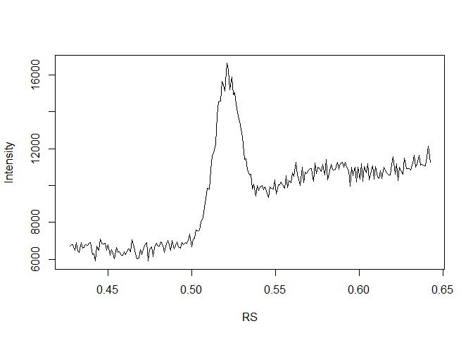
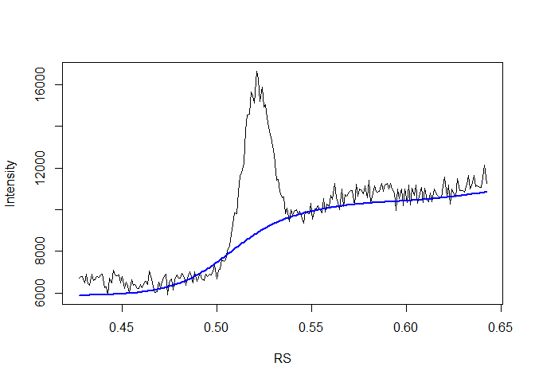
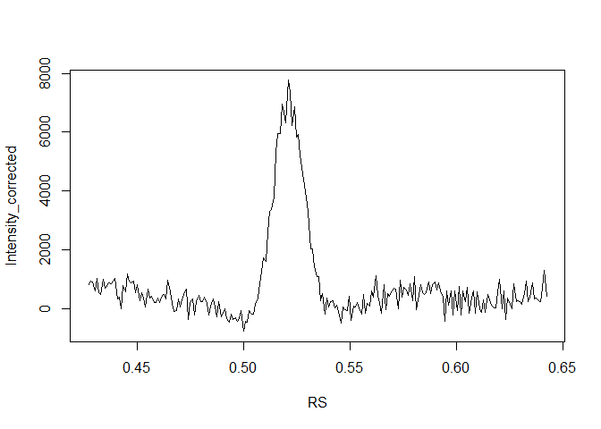

## Introduction

The Asymmetric Least Squares (ALS) method is a technique used to correct
baseline drifts in various types of data by iteratively fitting a smooth
baseline that minimizes the weighted sum of squared residuals, allowing
for effective separation of the true signal from background noise.This
method is commonly used to correct baseline drifts in spectral data,
chromatographic data, time-series data, sensor data, and data from
diffractograms.

## Mathematical Formulation

The ALS method works as follows:

1.  **Initial Estimation:**

    -   Start with an initial estimate of the baseline, typically a
        smooth function like a straight line.

2.  **Weighted Residual Minimization:**

    -   The goal is to minimize the sum of squared residuals between the
        observed data 
        and the baseline
        , with different
        weights applied to positive and negative residuals.

3.  **Mathematical Formulation:**

    -   For observed data points
        "),
        the baseline  is
        estimated by solving the following optimization problem:

    ^2 + \lambda \sum_{i=1}^{n} (D^2 z)_i^2")

    -   Here,  are
        the weights,
        
        is a smoothing parameter, and
         is a difference
        operator to ensure smoothness of the baseline
        .

4.  **Weight Update:**

    -   The weights
         are
        updated asymmetrically based on the residuals
        :

    

    -   Here,  is a
        parameter between 0 and 1 (commonly set around 0.5).

5.  **Iteration:**

    -   Repeat the minimization and weight update steps until
        convergence, meaning the changes in
         are below a
        certain threshold or a maximum number of iterations is reached.

### Detailed Steps:

1.  **Initialization:**

    -   Start with an initial baseline
        .

2.  **Optimization:**

    -   Solve the weighted least squares problem with the current
        weights:

    } = \arg\min_{z} \sum_{i=1}^{n} w_i^{(k)} (y_i - z_i)^2 + \lambda \sum_{i=1}^{n} (D^2 z)_i^2")

3.  **Weight Update:**

    -   Update weights based on the residuals:

    } = \begin{cases} 
    p & \text{if } y_i > z_i^{(k+1)} \\
    1-p & \text{if } y_i \leq z_i^{(k+1)}
    \end{cases}")

4.  **Convergence Check:**

    -   Check if the change in
         is below a
        predetermined threshold. If not, return to the optimization
        step.

The iterative process ensures that the baseline
 converges to a smooth
curve that effectively separates the true signal from the background
noise, particularly in data with significant baseline variations.

## Exemple of Application in R

### SAXS data

We will try to fit the baseline using the SAXS dataset, which consists
of data from a diffractogram of bovine lipids. The data represents the
intensity of the signal as a function of the reciprocal spacing.

``` r
data<-read.table("./Data/SAXS.txt")
```

The data can be visualized.

``` r
plot(data,type="l")
```



As depicted in the plot, the baseline increases in intensity as the RS
increases. One would like to estimate the baseline using the ALS method
and to subtract it to isolate the signal.

### The **baseline** library

The **baseline** library can be uploaded.Be aware that the data has to
be converted to an horizontal vector. Choose the
 and
 values adequately.

``` r
library(baseline)
```

    ## 
    ## Attachement du package : 'baseline'

    ## L'objet suivant est masqué depuis 'package:stats':
    ## 
    ##     getCall

``` r
b<-getBaseline(baseline(t(as.vector(data$Intensity)),method = "als",lambda=4.5,p=0.05))

data$b<-t(b)

plot(Intensity~RS,data=data,type="l")
points(b~RS,data=data,type="l", col="blue", lwd=2)
```



We can then plot the result.

``` r
data$Intensity_corrected<-data$Intensity-data$b

plot(Intensity_corrected~RS,data=data,type="l")
```


